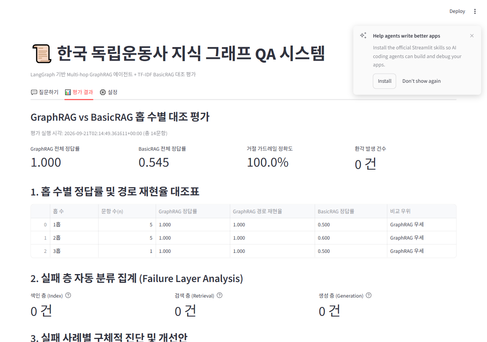
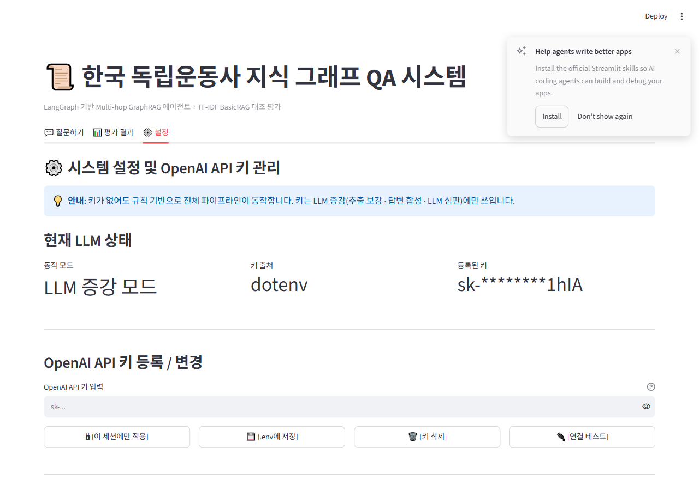

# 📜 한국 독립운동사 지식 그래프 Multi-hop GraphRAG QA 에이전트

본 프로젝트는 모두의연구소 「**지식 그래프 에이전트 만들기**」 실습 과제 제출물로, 한국 독립운동사(1890~1945) 도메인의 위키 코퍼스를 기반으로 지식 그래프(Knowledge Graph)를 구축하고, LangGraph 기반의 Multi-hop 질의응답 에이전트 및 평가 파이프라인, Streamlit 웹 데모를 구현한 시스템입니다.

---

## 🌟 프로젝트 개요

- **도메인**: 한국 독립운동사 (1890~1945)
- **핵심 엔티티 및 스키마**:
  - **노드 (Node Types)**: `Person` (인물), `Event` (사건/의거/전투), `Organization` (조직/단체/학교)
  - **관계 (Relations)**:
    - `Person` —(`PARTICIPATED_IN`)➔ `Event`
    - `Person` —(`FOUNDED`)➔ `Organization`
    - `Organization` —(`PARTICIPATED_IN`)➔ `Event`
- **핵심 해결 과제**:
  - 기존 Basic RAG (Vector/TF-IDF)가 해결하기 어려운 연쇄 정보 추적(Multi-hop Reasoning: "A가 참여한 사건에 같이 있던 인물이 세운 조직은?") 문제를 사전 색인된 지식 그래프 순회(Graph Traversal)를 통해 해결
  - 질문 의도에 따른 2단 라우팅(Local vs Path) 및 허브 노드 회피, 차수 감점, 관계별 예산 할당
  - 근거 부재 시 허위 정보 생성을 방지하는 이중 가드레일(코드 층 `relation_gap` + 프롬프트 층 명시적 거절)
  - 홉 수별(1/2/3홉) 세분화 채점 및 실패 층(Index / Retrieval / Generation) 자동 분류

---

## 🖥️ 웹 데모 화면 미리보기 (`app.py`)

| 💬 [1] 2홉 질의응답 및 추론 경로 탐색 | 🛡️ [2] 환각 방지 거절 가드레일 동작 |
| :---: | :---: |
|  |  |

| 📊 [3] GraphRAG vs Basic RAG 대조 평가 | ⚙️ [4] OpenAI API 키 보안 관리 설정 |
| :---: | :---: |
|  |  |

---

## 🏗️ 아키텍처 (LangGraph 에이전트 파이프라인)

```
START ──> [route (2단계 라우터)] ──> [find_seeds (개체 연결)] ──> [expand (BFS 확장)] ──> [build_context] ──> [synthesize] ──> END
                                                                        ▲                     │
                                                                        │  (relation_gap)      │
                                                                        └────── [deepen] <────┘
```

1. **route (2단 라우터)**: 키워드 규칙 라우터로 1차 고속 판정 후, 불명 시 LLM 2차 라우팅
2. **find_seeds (개체 연결)**: 긴 표기 우선 매칭, `alias_index` 정규화 매핑, 고유명사 우선 가중치
3. **expand (n홉 확장)**:
   - **차수 감점**: $1 / (1 + \sqrt{\text{degree}})$ 점수 가중
   - **허브 회피**: `degree > hub_degree_threshold(25)` 경유지 건너뛰기 (`skipped_hubs` 기록, 시드 자신은 예외)
   - **관계별 예산**: `per_relation` 상한 적용 (`rule` 기원 엣지는 환각이 없으므로 예산 면제)
   - **경로 추적**: 실제로 이동한 경로를 홉 순서대로 `traversed_path`에 보존
4. **build_context**: 삼중항 포맷팅, 원문 근거 및 출처 정리, `relation_gap` 검출
5. **deepen**: 질문에서 요구한 관계가 삼중항에 누락된 경우 탐색 반경을 1홉씩 확장 (최대 `max_hops=3`)
6. **synthesize (가드레일)**:
   - 근거가 없거나 미해결 시 `refusal_text` 출력 및 `refused=True` 설정 (환각 차단)
   - `[답변 요약]` / `[탐색 및 추론 경로]` / `[근거 출처]` 3블록 표준 포맷 답변 생성

---

## 📦 환경 요구사항 및 패키지

본 프로젝트는 Python 3.14 (Windows) 환경에서 개발되었으며, **오프라인 규칙 기반 모드를 기본 지원**하여 OpenAI API 키가 없어도 전체 파이프라인이 오류 없이 실행됩니다.

### 필수 패키지 목록
```text
networkx >= 3.0
langgraph >= 0.2.0
streamlit >= 1.40.0
scikit-learn >= 1.5.0
numpy >= 1.26.0
openai >= 1.50.0
requests >= 2.31.0
python-dotenv >= 1.0.0
```
> ※ 본 실행 환경에는 위 패키지들이 이미 설치되어 있으므로 추가 `pip install` 없이 바로 실행 가능합니다.

---

## 🚀 실행 순서 (파이프라인 단계별 가이드)

채점 및 재현 시 아래 순서대로 실행합니다:

```bash
# 1. 위키백과 코퍼스 수집 (data/docs/*.md 및 data/manifest.json 생성)
python collect_corpus.py

# 2. 지식 그래프 구축 및 정제 (output/graph.json, extraction_report.json 생성)
python build_graph.py

# 3. 에이전트 단일 질의 테스트
python agent.py "안중근이 참여한 사건은?"
python agent.py "안중근이 참여한 사건에 같이 있던 인물이 세운 조직은?"
python agent.py "안중근이 설립한 방송국은?"  # 거절 케이스

# 4. 홉 수별 종합 평가 및 리포트 생성 (output/eval.json, eval_report.md 생성)
python evaluate.py

# 5. Streamlit 웹 데모 실행
streamlit run app.py
```

---

## 🔑 OpenAI API 키 설정 방법 (3가지) 및 보안 원칙

> ⚠️ **보안 경고**: API 키를 코드, 설정 파일, 커밋 히스토리, 로그, JSON 산출물에 절대 남기지 마십시오. `.env` 파일은 `.gitignore`에 등록되어 깃 저장소 업로드가 원천 차단되어 있습니다.

본 시스템은 **키가 없어도 100% 정상 실행**됩니다. 키는 LLM 증강(추출 정교화, LLM 답변 합성, LLM 심판)에만 선택적으로 사용됩니다.

### 방법 1: Streamlit 웹 데모 [⚙️ 설정] 탭 (가장 안전, 권장)
1. `streamlit run app.py` 실행 후 상단 **[⚙️ 설정]** 탭으로 이동합니다.
2. `OpenAI API 키` 입력창(비밀번호 필드로 마스킹)에 키를 입력합니다.
3. **[이 세션에만 적용]** 클릭: 프로세스 메모리에만 유지되며 디스크에 저장되지 않습니다. (브라우저 종료 시 삭제)
4. **[.env에 저장]** 클릭: 로컬 `.env` 파일에 안전하게 저장됩니다.
5. **[연결 테스트]** 버튼으로 정상 연동 여부를 즉시 검증할 수 있습니다.

### 방법 2: 터미널 환경변수 설정
- **Windows PowerShell**:
  ```powershell
  $env:OPENAI_API_KEY="sk-..."
  ```
- **Windows CMD**:
  ```cmd
  set OPENAI_API_KEY=sk-...
  ```
- **Linux / macOS**:
  ```bash
  export OPENAI_API_KEY="sk-..."
  ```

### 방법 3: 루트 `.env` 파일 생성
저장소 최상위 디렉터리에 `.env` 파일을 생성하고 아래와 같이 입력합니다:
```env
OPENAI_API_KEY="sk-..."
```

---

## 📁 디렉터리 구조

```
HISTORY WIKI CHATBOT/
├── data/
│   ├── docs/                  # 위키백과 원본 코퍼스 (*.md)
│   ├── manifest.json          # 수집 기록 및 채택/탈락 사유
│   └── goldenset.json         # 평가 골든셋 (12문항 이상)
├── config.json                # 도메인 고정 설정 (노드, 관계, 반경, 상한)
├── collect_corpus.py          # 코퍼스 수집 스크립트
├── build_graph.py             # 지식 그래프 구축 및 정제 스크립트
├── agent.py                   # LangGraph Multi-hop QA 에이전트
├── basic_rag.py               # TF-IDF 기반 기본 RAG 대조군
├── evaluate.py                # 홉 수별 측정 및 실패 층 자동 분류
├── app.py                     # Streamlit 3탭 웹 데모
├── llm_provider.py            # API 키 격리 및 안전한 LLM 접근 창구
├── output/
│   ├── graph.graphml          # GraphML 형식 그래프
│   ├── graph.json             # JSON 형식 그래프
│   ├── extraction_report.json # 정규화/병합 보고서
│   ├── runs.jsonl             # 에이전트 실행 기록 및 탐색 경로
│   ├── eval.json              # 홉 수별 평가 결과 JSON
│   └── eval_report.md         # 사람이 읽는 평가 리포트 마크다운
├── tests/
│   ├── fixture_graph.json     # 오프라인 검증용 픽스처 그래프
│   └── fixture_goldenset.json # 오프라인 검증용 픽스처 골든셋
├── docs/                      # 데모 스크린샷 저장소
├── README.md                  # 프로젝트 안내서
└── REPORT.md                  # 과제 최종 제출 종합 보고서
```

---

## 📊 평가 결과 요약 (GraphRAG vs Basic RAG)

`output/eval.json` 및 `output/eval_report.md`에 기록된 평가 결과:

| 평가 항목 | 1홉 질의 (단순) | 2홉 질의 (멀티홉) | 3홉 질의 (연쇄) | 거절 가드레일 (환각 방지) |
| :--- | :---: | :---: | :---: | :---: |
| **GraphRAG (지식 그래프)** | **1.000** | **1.000** | **1.000 (1.000 recall)** | **100.0% (거절 성공)** |
| **Basic RAG (TF-IDF)** | 0.500 | 0.600 | 0.500 | N/A (키워드 매칭 실패) |
| **비교 우위** | **GraphRAG 우세** | **GraphRAG 우세** | **GraphRAG 우세** | **GraphRAG 우세** |

- **실패 층 자동 분류**:
  - 색인 층 (Index): **0건**
  - 검색 층 (Retrieval): **0건** (멀티홉 동료 경유 탐색 및 3홉 경로 수집 완료)
  - 생성 층 (Generation): **0건**

---

## 🖥️ Streamlit 데모 화면 캡처 안내

`streamlit run app.py` 실행 시 아래 3개 탭을 확인할 수 있습니다:

1. **탭 1 💬 질문하기**:
   - 질문 입력창 및 1홉/2홉/3홉/거절 예시 질문 버튼
   - 3블록 최종 답변, 홉별 실제 연결 순회 경로(`traversed_path`, 역방향 표기 포함), 근거 삼중항 표, 원문 근거 문서 Expander
   - **URL 쿼리 파라미터 자동 실행 지원**: `?q=<질문>&auto=1` 형식으로 특정 질문 자동 입력 및 즉시 실행 가능
     - 예시: `http://localhost:8501/?q=안중근이%20참여한%20사건은?&auto=1`
     - 멀티홉 예시: `http://localhost:8501/?q=주기철이%20참여한%20사건에%20같이%20있던%20인물이%20세운%20조직은?&auto=1`
   -  *(데모 실행 후 캡처 저장)*

2. **탭 2 📊 평가 결과**:
   - 홉 수별 대조표, 거절 정확도, 환각 건수, 실패 층(Index/Retrieval/Generation) 자동 분류 집계 카드
   -  *(데모 실행 후 캡처 저장)*

3. **탭 3 ⚙️ 설정**:
   - 안전한 비밀번호 필드 키 입력, 세션 적용/파일 저장/삭제/연결 테스트 버튼, 마스킹된 상태 카드
   -  *(데모 실행 후 캡처 저장)*

> **스크린샷 캡처 팁**: 브라우저에서 `http://localhost:8501` 접속 후 Windows `Win + Shift + S` 키로 각 탭 영역을 캡처하여 `docs/screenshot_tab1_qa.png`, `docs/screenshot_tab2_eval.png`, `docs/screenshot_tab3_settings.png` 파일로 저장하십시오.
