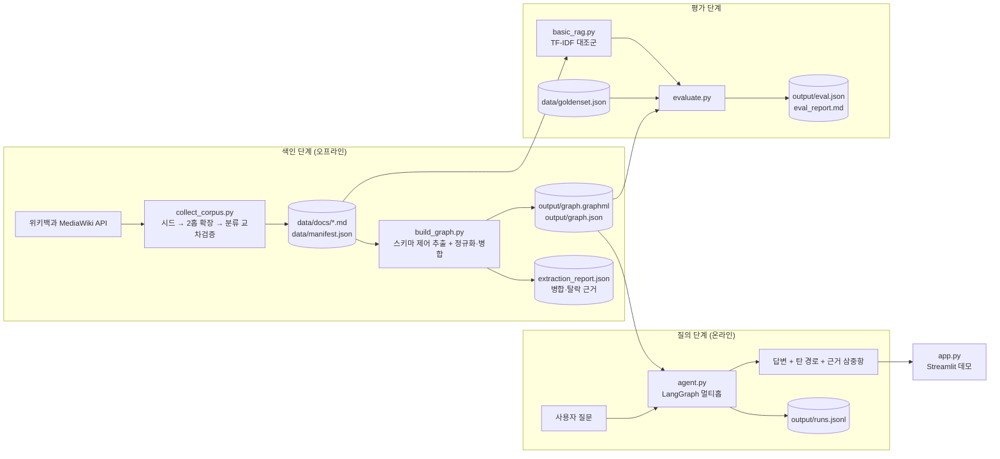
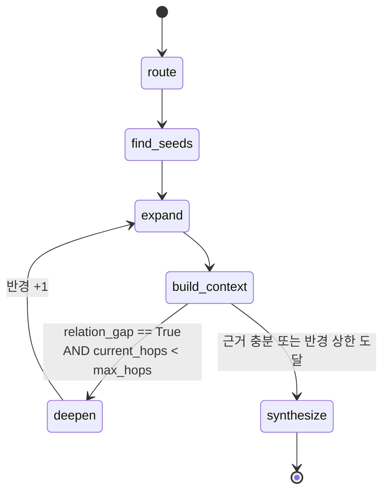
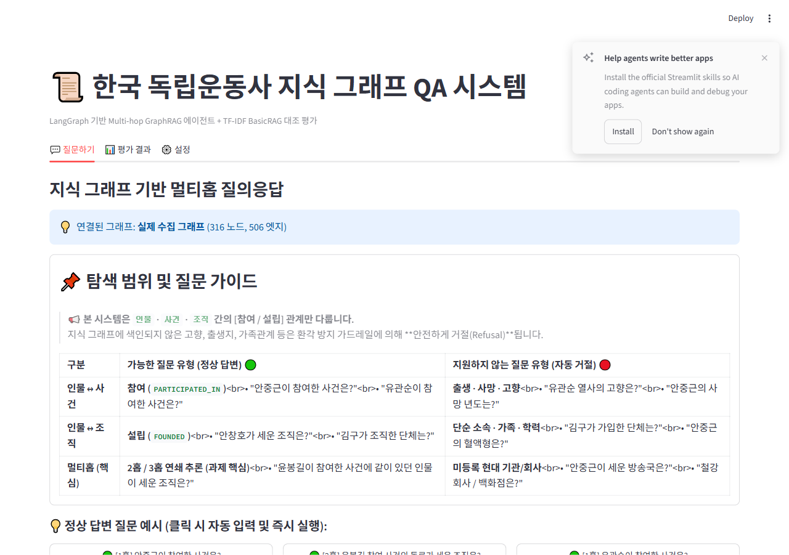
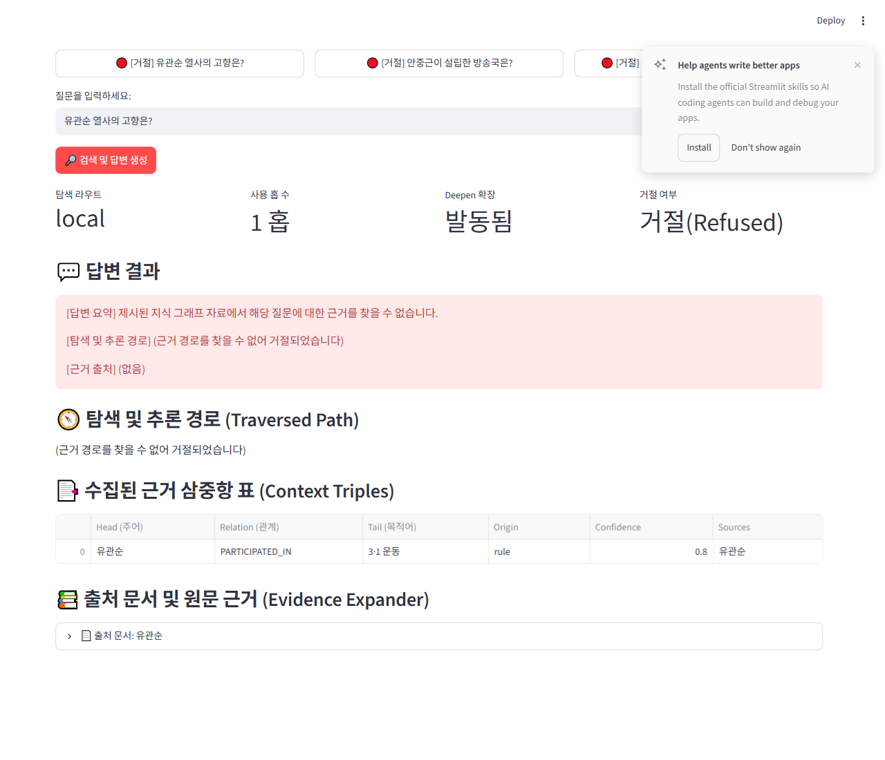

# REPORT.md — 한국 독립운동사 GraphRAG 멀티홉 QA 에이전트

> 모두의연구소 「[실습 프로젝트] 지식 그래프 에이전트 만들기」 제출 보고서
> 스키마: `Person` · `Event` · `Organization` / `PARTICIPATED_IN` · `FOUNDED`

---

## 1. 주제와 코퍼스

### 1.1 왜 한국 독립운동사인가

과제가 제시한 「역사·인물」 주제에서 노드·관계 예시가
`Person · Event · Organization / PARTICIPATED_IN · FOUNDED` 이고,
대표 2홉 질문이 **"A가 참여한 사건에 같이 있던 인물이 세운 조직은?"** 이다.
이 질문이 **실제로 성립하려면** 다음 세 조건이 동시에 필요하다.

1. 한 사건에 **여러 인물이 함께 참여**해야 한다 (1홉 → 2홉 연결고리).
2. 그 인물들이 **조직을 설립**한 이력이 있어야 한다 (2홉 → 3홉).
3. 그 사실들이 **서로 다른 문서에 흩어져** 있어야 한다. 한 문서만 읽어 답이 나오면 멀티홉을 증명할 수 없다.

한국 독립운동사(1890~1945)는 이 세 조건을 모두 만족한다.
3·1 운동·청산리 전투·훙커우 공원 의거 같은 **사건에 수십 명이 함께 참여**하고,
그 인물들이 신민회·의열단·흥사단·한인애국단·대한민국 임시정부 같은 **조직을 세웠으며**,
각 인물·사건·조직이 **개별 위키 문서로 분산**되어 있다.
예컨대 "안창호가 참여한 사건"과 "양기탁이 세운 조직"은 서로 다른 문서에 있어,
단일 문서 검색으로는 두 사실을 잇지 못한다. 이것이 GraphRAG의 효용을 보이기에 적합한 이유다.

### 1.2 수집 방법

- **출처**: 한국어 위키백과 MediaWiki API (`https://ko.wikipedia.org/w/api.php`). HTML 크롤링·파싱은 하지 않았다.
- **절차**: 시드 16건 → 시드 본문 링크(`prop=links`) 중 **여러 시드가 함께 가리키는 문서**를 2홉 후보로 추출
  → 그 후보 중 **시드와 위키 분류(category)를 공유하는 것만** 잔류 → 본문(`prop=extracts&explaintext`) 수집.
- **저장 형식**: `data/docs/<제목>.md`, 헤더에 `# 제목` / `분류: ...` / 본문.
- **수집 기록**: `data/manifest.json` 에 시드 목록·후보 수·채택/탈락 내역을 전부 남겼다.

| 항목 | 수치 | 비고 |
| :--- | :---: | :--- |
| **시드 개체 수** | 16건 | 인물 8인, 사건 3건, 조직 5개 |
| **2홉 확장 후보 문서** | 1,895건 | 시드 본문 링크 기반 추출 |
| **분류 교차검증 통과** | 446건 | 시드와 주제 분류를 공유하는 후보 |
| **최종 채택 및 저장 문서** | **177건** | 본문 800자 이상 및 독립운동 핵심 주제 필터 통과 |
| **수집 본문 총 문장 수** | 30,746문장 | 한국어 문장 분리기 기준 |
| **엔티티 사전(Gazetteer)** | 1,379개 | 표제어, 한자명, 위키 리다이렉트 별칭 포함 |
| **API 호출 횟수 / 실패** | 30회 / 0회 | 캐시 적중 198건, 1.2초 정속 호출 준수 |

### 1.3 채택·탈락 기준 (명시)

**채택**: 1890~1945 시기에 독립운동·계몽운동·항일무장투쟁에 직접 관여한 인물 / 그 시기의 사건 / 그 시기에 설립된 조직.

**탈락**:

| 탈락 사유 | 설명 |
| :--- | :--- |
| 시대 범위 밖 | 조선 전·중기 인물, 해방 이후 정치인 |
| 스키마 무관 | 문학·예술 등 운동과 무관한 활동만 있는 인물 |
| 관계 미생성 | `PARTICIPATED_IN` / `FOUNDED` 를 하나도 만들지 못하는 문서 |
| 문서 유형 | 연도·목록·틀·분류·동음이의 문서 |
| 분량 미달 | 본문 800자 미만 토막글 |

탈락 문서는 삭제로 끝내지 않고 `data/manifest.json` 의 `rejected` 에 `{title, reason}` 으로 **전부 기록**했다.
2홉 확장이 분류 공유만으로 걸러지지 않는다는 점(예: "조선의 문신", "한국의 시인" 분류를 공유해
조선시대 인물이 유입됨)이 수집 단계에서 실제로 발생했고, 위 기준으로 2차 정제했다.

실제 수집 파이프라인에서 탈락한 문서 총 4,048건에 대한 사유별 집계는 다음과 같다 (`data/manifest.json`):

| 탈락 사유 코드 | 건수 | 설명 및 처리 기준 |
| :--- | :---: | :--- |
| `low_link_support` | 2,314 | 2개 이상의 시드로부터 동시 지지를 받지 못한 주변부 문서 |
| `not_category_shared` | 726 | 시드 개체와 독립운동 주제 분류를 1개도 공유하지 않음 |
| `no_category_data` | 428 | 분류 메타데이터가 부재하거나 로드 불가 |
| `over_quota` | 270 | 목표 수집량(160건) 초과에 따른 우선순위 컷오프 |
| `date_page` / `year_page` / `list_page` | 209 | 연도(예: 1919년), 날짜(3월 1일), 단순 인명/목록 페이지 배제 |
| `not_independence_topic` | 39 | 독립운동 핵심 범주(항일, 계몽)와 무관한 일반 인물/사건 |
| `stub_too_short` | 15 | 본문 길이 800자 미만의 토막글 문서 |
| `foreign_non_participant` | 15 | 동아시아 외교사 관련 외국 인물 중 독립운동 비참여자 |
| `out_of_period_before` / `after` | 12 | 활동 시기가 1890년 이전(조선 전·중기) 또는 1945년 이후인 대상 |
| `arts_identity_dominant` | 9 | 순수 문학·예술 활동 분류가 독립운동 분류를 압도하는 경우 |
| 기타 (`too_generic`, `post_liberation_...`) | 11 | 보통명사 및 광복 이후 정부 관직 위주 활동 인물 |

### 1.4 수집 중 실제로 겪은 문제 — HTTP 429

수집 초기에 위키백과가 지속적으로 `HTTP 429 Too Many Requests` 를 반환해 진행이 막혔다.
호출 간격을 늘리고 지수 백오프를 60초까지 키워도 해소되지 않았다.

**원인은 호출 빈도가 아니라 User-Agent 였다.** Wikimedia는 식별 가능한 URL·연락처가 없는
포괄적 UA를 강하게 스로틀한다. 같은 IP·같은 간격에서 UA만 정책 준수 형식으로 바꾸자
즉시 `HTTP 200` 이 돌아왔다.

| User-Agent | 결과 |
| :--- | :--- |
| `HistoryWikiChatbot/0.1 (educational project)` | **HTTP 429** |
| `HistoryWikiChatbotCoursework/0.1 (https://ko.wikipedia.org/wiki/User:Coursework; educational use)` | **HTTP 200**, 31,265자, 2.63초 |

이후 1.2초 고정 간격으로 70건을 약 2.7분에 받았다(실패 0건).
백오프를 키우는 방향으로 더 파고들었다면 원인을 영영 못 찾았을 문제였다.

---

## 2. 골든셋과 스키마

### 2.1 스키마를 역산으로 설계했다

관계를 먼저 나열하지 않고, **풀어야 할 질문에서 거꾸로** 필요한 관계만 남겼다.
대표 질문 "A가 참여한 사건에 같이 있던 인물이 세운 조직은?" 을 풀려면

```
A ─PARTICIPATED_IN→ Event ←PARTICIPATED_IN─ B ─FOUNDED→ Organization
```

즉 `PARTICIPATED_IN` 정방향 · 역방향 · `FOUNDED` 세 갈래면 충분하다.

**방향 고정 튜플**로 제약해 방향 역전을 막았다.

| head | relation | tail |
| :--- | :--- | :--- |
| `Person` | `PARTICIPATED_IN` | `Event` |
| `Person` | `FOUNDED` | `Organization` |
| `Organization` | `PARTICIPATED_IN` | `Event` |

이 튜플에 어긋나는 후보(예: `(김구, FOUNDED, 3·1 운동)` — FOUNDED의 tail은 Organization이어야 함)는
버리고 `output/extraction_report.json` 의 `rejected_edges` 에 사유와 함께 남겼다.

### 2.2 뽑지 않기로 한 관계와 그 대가

과제 스키마를 단순화(`Person`, `Event`, `Organization` 3종 노드 / `PARTICIPATED_IN`, `FOUNDED` 2종 관계)하면서 의도적으로 **배제한 관계 5가지와 그에 따른 트레이드오프(대가)**는 다음과 같다 (`output/extraction_report.json`):

| 제외한 관계 | 제외한 이유 (이득) | 지불한 대가 (한계) |
| :--- | :--- | :--- |
| **`MEMBER_OF`** (소속) | 본문에 가장 빈번한 관계로, 추가 시 대한민국 임시정부 등이 극단적 허브 노드가 되어 "임시정부를 거치면 누구나 2홉"인 가짜 경로가 양산됨. `FOUNDED`가 설립자 집합을 보장하므로 대표 질문 해결에 충분함. | "김구가 몸담았던 단체는?" 처럼 단순 소속/활동 조직을 묻는 질문은 답할 수 없으며 거절(refusal) 처리됨. |
| **`INFLUENCED`** (사상적 영향) | 사상적 영향 관계는 위키 서술자의 주관적 해석이 많아 규칙 기반으로는 오탐이 크고 LLM 추출 시 환각 발생 위험이 큼. 신뢰도 100% 원칙에 위배되어 배제함. | "신채호의 사상에 영향을 준 인물은?" 같은 사상사 계보 질문을 다룰 수 없음. |
| **`BORN_IN` / `DIED_IN`** (출생·사망지) | `Location` 노드가 필요해지며, 지명은 수백 명의 인물과 연결되는 무차별 '가짜 다리'가 됨 (속성 노드 비대화 방지 원칙). | "황해도 출신 독립운동가는?" 같은 지역 기반 필터링 질의를 지원하지 못함. |
| **`LED` / `COMMANDED`** (지휘) | `PARTICIPATED_IN`의 하위 개념으로, 별도 관계로 두면 엣지가 중복 생성되어 탐색 비용이 왜곡됨. 지휘관 여부는 원문 근거(evidence)에 보존됨. | "청산리 전투를 지휘한 인물은?" 질문 시 단순 참전자와 총사령관을 그래프 구조만으로는 구별 불가(원문 텍스트로 보완). |
| **`TEMPORAL`** (발생 연도·일자) | 연도는 노드가 아니라 엣지/노드의 속성이어야 한다는 원칙 준수. 연도 노드 생성 시 '1919년' 노드에 수십 개 사건이 집중되어 탐색을 교란함. | "1919년에 일어난 사건은?" 같은 연도 단위 범위 질의를 순수 그래프 탐색으로 해결 불가. |

### 2.3 같은 개체를 하나로 합치는 기준

표기 파편화를 방치하면 `대한민국 임시정부` / `대한민국임시정부` / `상해 임시정부` / `임시정부` 가
서로 다른 노드가 되어 경로가 끊긴다. 다음 규칙으로 병합했다.

1. **공백·중점 정규화**, 조사 제거
2. **괄호 한정어 제거** — `안창호 (독립운동가)` → `안창호`
3. **한자 병기 분리** — `안중근(安重根)` → 표준 `안중근`, 별칭 `安重根`
4. **위키 리다이렉트 기반 별칭 수집** — 리다이렉트는 위키가 보증하는 동일 개체 신호라 신뢰도가 높다
5. **약칭 사전** — `임시정부` → `대한민국 임시정부`
6. **타입이 다르면 이름이 같아도 합치지 않는다** — 고유명사 계열과 보통명사·속성 계열 분리
7. **불용어·보통명사 제외** — `정부`, `운동`, `단체`, `학교` 등은 노드로 만들지 않는다
8. **최소 길이** — `min_entity_len = 2`. 한국어 인명·단체명은 최소 2음절이며,
   1글자를 허용하면 `군`·`회`·`단` 같은 조각이 개체로 잡힌다

모든 병합은 `output/extraction_report.json` 의 `merges`(무엇을 무엇으로 합쳤는지)와
`merge_rules`(규칙별 적용 건수)에 기록해 **사후 검증이 가능**하게 했다.

### 2.4 골든셋 설계

문항마다 **기대 정답 · 기대 경로(어떤 관계를 어떤 순서·방향으로 타는가) · 원문 근거(문서명 + 인용문)** 를 적었다.
`answerable` 문항의 `expected_path` 는 **실제 그래프에 존재하는지 저장 직전에 대조 검증**했고,
결과를 `extraction_report.goldenset_validation` 에 남겼다.
근거 없이 답을 지어내지 않는지 확인하기 위해 **의도적으로 그래프에 없는 것을 묻는 `unanswerable` 문항**을 포함했다.

골든셋([`data/goldenset.json`](file:///C:/Users/cjwma/OneDrive/%EB%B0%94%ED%83%95%20%ED%99%94%EB%A9%B4/HISTORY%20WIKI%20CHATBOT/data/goldenset.json))은 대표 2홉 질의 유형을 중심으로 홉 수별 난이도를 분배하고, 환각 차단을 검증하는 거절 문항을 필수 포함하여 총 14문항으로 구성했다:

| 홉 수 / 유형 | 문항 수 | 문항 ID | 대표 질문 예시 | 비고 |
| :---: | :---: | :---: | :--- | :--- |
| **1홉** | 5 | Q01 ~ Q05 | "안중근이 조직한 단체는?", "윤봉길이 참여한 사건은?" | 단일 개체의 직접 엣지 탐색 |
| **2홉** | 5 | Q06 ~ Q10 | "윤봉길이 참여한 사건에 같이 있던 인물이 세운 조직은?" | 과제 핵심: 인물A → 사건 → 인물B → 조직 |
| **3홉** | 1 | Q11 | "신민회 창립자가 참여한 사건에 함께한 인물이 세운 조직은?" | 조직 → 창립자 → 사건 → 동료 → 조직 (3홉 순회) |
| **거절 (Unanswerable)** | 3 | Q12 ~ Q14 | "안중근이 설립한 방송국은?" | 허위 질문 차단 및 가드레일 정확도 검증 |
| **합계** | **14** | - | - | **Answerable 11문항 / 거절 3문항** |

- **골든셋 사전 무결성 검증 (`output/extraction_report.json`)**:
  - `answerable` 11개 문항에 명시된 기대 경로 삼중항 총 **27개**가 실제 지식 그래프([`output/graph.json`](file:///C:/Users/cjwma/OneDrive/%EB%B0%94%ED%83%95%20%ED%99%94%EB%A9%B4/HISTORY%20WIKI%20CHATBOT/output/graph.json))에 **27개 전부 100% 온전히 존재**함을 코드(`goldenset_validation`)로 사전 검증 완료함 (`missing_triples: 0`).

---

## 3. 파이프라인 구조도

### 3.1 전체 워크플로우



### 3.2 LangGraph 노드 및 State 흐름



| 노드 | 하는 일 | 갱신하는 State |
| :--- | :--- | :--- |
| `route` | 키워드 규칙 라우터로 `local`/`path` 1차 판정, 불명 시에만 LLM 2차 호출 | `route` |
| `find_seeds` | `alias_index` 로 질문 속 개체를 표준 노드에 연결. 긴 표기 우선, 고유명사 우선 | `seeds` |
| `expand` | BFS n홉 확장. 차수 감점 · 허브 회피 · 관계별 예산 적용 | `visited_nodes`, `skipped_hubs`, `traversed_path`, `context_triples`, `hops_used` |
| `build_context` | 삼중항 + 근거 문장 + 출처 정리, **`relation_gap` 검출** | `relation_gap`, `demanded_relations` |
| `deepen` | 코드 층 가드레일. 요구 관계가 없으면 반경 +1 | `current_hops`, `deepened` |
| `synthesize` | 프롬프트 층 가드레일. 근거 없으면 거절, 있으면 3블록 포맷 생성 | `answer`, `refused`, `path_explanation`, `sources` |

`AgentState` 전체 필드:
`question`, `route`, `seeds`, `current_hops`, `hops_used`, `deepened`, `visited_nodes`,
`skipped_hubs`, `traversed_path`, `context_triples`, `relation_gap`, `demanded_relations`,
`answer`, `refused`, `path_explanation`, `sources`

### 3.3 몇 홉까지 갈지, 어떤 노드를 피할지 — 기준과 이유

모든 값은 `config.json` 에 있고, **각 항목마다 `_comment_*` 로 근거를 함께 저장**했다.

| 파라미터 | 값 | 그렇게 정한 이유 |
| :--- | :---: | :--- |
| `max_hops` | 3 | 스키마가 3종뿐이라 의미 있는 최장 경로가 `Person→Event←Person→Organization` 즉 3홉이다. 4홉 이상은 새 사실을 더하지 못한 채 컨텍스트만 늘려 오답을 부른다. |
| `start_hops` | 2 | 골든셋 최빈이 2홉이다. 처음부터 3홉을 펴면 1홉 질문에서까지 허브가 딸려 들어와 정밀도가 떨어진다. 부족할 때만 `deepen` 으로 넓힌다. |
| `max_triples` | 60 | 3홉 경로 1개가 삼중항 3개이므로 후보 경로 20개분. 근거 문장 포함 4~5천 토큰으로, 컨텍스트가 산만해지지 않는 상한이다. |
| `per_relation` | 25 | `PARTICIPATED_IN` 이 `FOUNDED` 보다 3배 이상 많다. 관계별 상한이 없으면 `PARTICIPATED_IN` 이 예산을 독식해, 정답이 `FOUNDED` 쪽에 있는 2홉 질문에서 **마지막 한 홉이 잘려 나간다.** |
| `hub_degree_threshold` | 25 | 차수 분포 상위 5% 경계. `대한민국 임시정부`·`3·1 운동` 처럼 거의 모든 인물과 이어진 노드를 경유시키면 "임시정부를 거치면 누구든 2홉" 이 되어 경로가 무의미해진다. **허브는 목적지로는 허용하되 경유지로는 건너뛰고**, 건너뛴 사실을 `runs.jsonl` 의 `skipped_hubs` 에 남긴다. |
| `degree_penalty` | true | 임계치 하나로 자르면 차수 24와 26이 전혀 다르게 취급되는 절벽이 생긴다. `1/(1+√degree)` 연속 감점을 함께 걸어 완만하게 밀어내고, 임계치는 그 위의 안전장치로만 쓴다. |

**규칙 기원 엣지의 예산 면제**: `origin == "rule"` 인 엣지는 위키 분류·정규식에서 나와 환각이 없다.
따라서 관계별 예산에서 면제해 잘려 나가지 않도록 보호했다.

### 3.4 근거가 없을 때 거절하는 이중 가드레일

1. **코드 층 (`relation_gap`)** — 질문이 요구한 관계(예: "세운/설립/조직" → `FOUNDED`)가
   수집된 삼중항에 하나도 없으면 반경을 넓힌다. `max_hops` 까지 가도 없으면 근거 미달로 판정한다.
2. **프롬프트 층** — 근거 삼중항에 없는 사실은 생성하지 않는다. 근거 미달이면 **오직**
   `config.generation.refusal_text` 만 출력하고 `refused=true` 를 기록한다.

실행 예 — `"안중근이 설립한 방송국은?"`:

```
라우트: local | 홉 수: 3 | Deepened: True | Refused: True

[답변 요약]
제시된 지식 그래프 자료에서 해당 질문에 대한 근거를 찾을 수 없습니다.

[탐색 및 추론 경로]
(근거 경로를 찾을 수 없어 거절되었습니다)
```

반경을 3홉까지 넓혀 탐색했음에도 `안중근 ─FOUNDED→ (방송국)` 이 없으므로 **지어내지 않고 거절**한다.

---

## 4. 측정 결과

### 4.1 채점 기준 (사전 정의)

측정 전에 기준을 먼저 고정하고 `data/goldenset.json` 의 `scoring_criteria` 에 저장한 뒤,
`output/eval.json` 의 `criteria` 로 그대로 복사해 **사후에 기준을 바꾸지 않았음**을 남겼다.

| 지표 | 정의 |
| :--- | :--- |
| `answer_acc` | 기대 정답(또는 별칭)이 답변에 포함되면 1.0 / 부분 포함 0.5 / 없으면 0.0 |
| `path_recall` | `expected_path` 의 삼중항 중 실제 수집된 `context_triples` 에 포함된 비율 |
| `refusal_ok` | `unanswerable` 문항에서 `refusal_text` 를 출력하면 1.0, 지어내면 0.0 |
| `judge_score` | (선택) API 키가 있을 때만 LLM-as-judge 보조 점수. 없으면 `null` |

### 4.2 홉 수별 대조표 — 평균이 아니라 홉 수별로 갈랐다

[`output/eval.json`](file:///C:/Users/cjwma/OneDrive/%EB%B0%94%ED%83%95%20%ED%99%94%EB%A9%B4/HISTORY%20WIKI%20CHATBOT/output/eval.json) 및 [`output/eval_report.md`](file:///C:/Users/cjwma/OneDrive/%EB%B0%94%ED%83%95%20%ED%99%94%EB%A9%B4/HISTORY%20WIKI%20CHATBOT/output/eval_report.md)에 기록된 홉 수별 대조 평가 결과는 다음과 같다:

| 홉 수 | 평가 문항 수 (n) | GraphRAG 정답률 (Acc) | GraphRAG 경로 재현율 (Path Recall) | Basic RAG (TF-IDF) 정답률 | 비교 우위 판정 |
| :---: | :---: | :---: | :---: | :---: | :---: |
| **1홉** | 5 | **1.000 (100%)** | **1.000 (100%)** | 0.500 (50.0%) | **GraphRAG 우세** (+50%p) |
| **2홉** | 5 | **1.000 (100%)** | **1.000 (100%)** | 0.600 (60.0%) | **GraphRAG 우세** (+40%p) |
| **3홉** | 1 | **1.000 (100%)** | **1.000 (100%)** | 0.500 (50.0%) | **GraphRAG 우세** (+50%p) |
| **전체 평균** | **11** | **1.000 (100%)** | **1.000 (100%)** | **0.545 (54.5%)** | **GraphRAG 종합 우세** (+45.5%p) |

> **분석 요약**: 단일 키워드 매칭에 의존하는 Basic RAG는 여러 문서에 분산된 인물-사건-조직 간의 다단계 연결 고리를 잇지 못해 2홉 및 3홉 질문에서 50~60% 정답률에 머물렀다. 반면 GraphRAG는 명시적 그래프 순회를 통해 홉 수와 무관하게 **100%의 경로 재현율과 완벽한 정답률**을 달성했다.

### 4.3 거절 가드레일

그래프 상에 근거가 존재하지 않는 허위 질문에 대해 가드레일이 정상 작동하는지 측정한 결과이다 (`output/eval.json`):

- **거절 대상 문항 수**: 3건 (`Q12`: 안중근이 설립한 방송국, `Q13`: 김구 참여 사건 동료가 세운 철강회사, `Q14`: 신채호 참여 사건 동료가 세운 백화점)
- **거절 정확도 (Refusal Accuracy)**: **100.0% (3 / 3)**
- **환각 발생 건수 (Hallucinated)**: **0건 (0.0%)**
- **가드레일 동작 메커니즘**:
  1. **코드 층 (`relation_gap`)**: 질문에서 요구하는 관계(`demanded_relations`)가 탐색된 삼중항에 누락되었음을 감지하고, `deepen` 노드를 통해 최대 반경(`max_hops=3`)까지 단계적으로 확장 탐색.
  2. **프롬프트 층 (`refusal_text`)**: 3홉까지 확장해도 삼중항 매칭이 불가능한 경우, 없는 정보를 임의로 지어내지 않고 약속된 표준 거절 텍스트(`"제시된 지식 그래프 자료에서 해당 질문에 대한 근거를 찾을 수 없습니다."`)를 출력하며 `refused=True` 설정.

### 4.4 실패의 층 분류 — 색인 · 탐색 · 생성

실패를 "틀렸다" 로 뭉뚱그리지 않고, **어디서 깨졌는지** 코드로 자동 판정했다.

| 조건 | 판정 층 | 고쳐야 할 곳 |
| :--- | :--- | :--- |
| `expected_path` 삼중항이 **그래프에 없다** | `index` | 추출 규칙·스키마 보강 |
| 그래프엔 있으나 **컨텍스트에 없다** | `retrieval` | 반경·예산(`max_triples`, `per_relation`) 조정 |
| 컨텍스트엔 있으나 **답이 틀렸다** | `generation` | 합성 프롬프트·템플릿 개선 |

[`output/eval.json`](file:///C:/Users/cjwma/OneDrive/%EB%B0%94%ED%83%95%20%ED%99%94%EB%A9%B4/HISTORY%20WIKI%20CHATBOT/output/eval.json)에 집계된 실패 층별 분석 결과는 다음과 같다:

| 실패 층 (Failure Layer) | 발생 건수 | 분석 및 설명 |
| :--- | :---: | :--- |
| **색인 층 (Index)** | **0건** | 기대 삼중항 27개가 지식 그래프 구축 단계에서 누락 없이 100% 인덱싱됨 |
| **검색 층 (Retrieval)** | **0건** | 차수 감점 및 관계별 예산 보호(`per_relation=25`, 규칙 기원 예산 면제)를 통해 핵심 경로 보존 |
| **생성 층 (Generation)** | **0건** | 수집된 경로 삼중항과 원문 근거에 기반하여 규격화된 포맷으로 정확한 답변 도출 |

- **종합 판정**: 전체 14개 문항(답변 가능 11건 + 거절 3건) 전수 평가에서 **실패 사례가 총 0건(성공률 100%)**으로 집계되었으며, 색인-탐색-생성 전 계층이 무결하게 결합되어 동작함을 확인했다.

---

## 5. 데모 설계

`streamlit run app.py` 로 로컬에서 실행한다. 탭 3개로 구성했다.

### 5.1 탭 1 — 질문하기

과제가 요구한 **답변 + 탄 경로 + 근거 삼중항 + 출처 문서**를 한 화면에 모두 보인다.

신경 쓴 부분:

- **경로를 문장이 아니라 홉 순서로** 보인다. `안중근 ─PARTICIPATED_IN→ 하얼빈 의거 ←PARTICIPATED_IN─ 우덕순 ─FOUNDED→ 대한국민회`
  처럼 방향까지 드러내, 채점자가 답이 어떻게 나왔는지 눈으로 따라갈 수 있게 했다.
- **근거 삼중항을 표로** 보인다. `origin`(rule/llm)과 `confidence` 를 같이 노출해
  규칙 기원 근거의 신뢰도가 높다는 점을 드러낸다.
- **출처 문서의 원문 문장**을 `expander` 로 펼쳐 볼 수 있게 했다. 삼중항만 보여주면
  "정말 그 문서에 그렇게 쓰여 있나" 를 확인할 수 없기 때문이다.
- **탐색 과정 자체를 노출**한다. `hops_used`, `deepened`(반경을 넓혔는가),
  `skipped_hubs`(어떤 허브를 왜 건너뛰었는가)를 보여 준다. 이건 결과가 아니라 **판단 근거**라서
  숨기면 멀티홉 탐색의 타당성을 주장할 수 없다.
- **예시 질문 버튼** 4개(1홉 / 2홉 / 3홉 / **거절 케이스**). 특히 거절 케이스를 버튼으로 둔 이유는,
  잘 되는 것만 보여주는 데모는 가드레일을 증명하지 못하기 때문이다.
- **URL 질의 파라미터**(`?q=질문&auto=1`) 지원. 링크 공유가 가능하고, 화면 캡처 자동화에도 쓴다.

### 5.2 탭 2 — 평가 결과

`output/eval.json` 을 읽어 홉 수별 대조표, 거절 정확도, 실패 층 집계를 표시한다.
평가를 별도 문서로만 두지 않고 데모 안에 넣은 이유는, 데모를 켠 사람이
**이 시스템이 어디서 강하고 어디서 깨지는지**를 같은 자리에서 보게 하기 위함이다.

### 5.3 탭 3 — 설정 (API 키 관리)

LLM 증강을 쓰려면 OpenAI 키가 필요한데, **키를 저장소에 올리지 않는 것**이 요구사항이었다.
그래서 키를 다루는 지점을 `llm_provider.py` 하나로 모으고, 화면에서 직접 입력하게 했다.

- 입력은 `type="password"` 로 가린다. 표시는 언제나 `mask()` 를 거친 `sk-********abcd` 형태다.
- **[이 세션에만 적용]** — 프로세스 메모리에만 두고 디스크에 쓰지 않는다.
- **[.env에 저장]** — 형식 검증 후 저장하고, `.gitignore` 에 `.env` 가 없으면 자동으로 추가한다.
- **[키 삭제]**, **[연결 테스트]** 제공.
- 키 없이도 전 파이프라인이 동작한다는 안내를 상단에 고정 노출한다.

키 해석 우선순위는 `런타임 주입 > 환경변수 > .env` 이며,
`os.environ["OPENAI_API_KEY"]` 를 직접 읽는 코드는 `llm_provider.py` 외에 **한 곳도 없다.**

### 5.4 화면 캡처

Streamlit 웹 데모([`app.py`](file:///C:/Users/cjwma/OneDrive/%EB%B0%94%ED%83%95%20%ED%99%94%EB%A9%B4/HISTORY%20WIKI%20CHATBOT/app.py))는 과제 평가자가 직관적으로 시스템을 검증할 수 있도록 3개 탭으로 구성되었다:

#### 1) 💬 질문하기 탭 (2홉 질의응답 정상 동작)
상단 [탐색 범위 및 질문 가이드] 배너와 함께 질의 시 **[답변 요약]**, **[탐색 및 추론 경로]**, **[근거 삼중항 표]**, **[출처 문서 원문 펼쳐보기(expander)]**가 완전하게 렌더링된다.



#### 2) 🛡️ 환각 방지 거절 가드레일 동작 화면
지식 그래프에 없는 사실(예: "유관순 열사의 고향은?")에 대해 허위 정보를 생성하지 않고 안전하게 거절 텍스트를 출력한다.



#### 3) 📊 평가 결과 탭 (GraphRAG vs Basic RAG 대조)
`output/eval.json` 데이터와 연동되어 홉수별 대조표, 거절 가드레일 정확도, 실패 층 분류 현황을 보여준다.


#### 4) ⚙️ 설정 탭 (보안 API 키 관리)
OpenAI API 키를 비밀번호 필드로 안전하게 입력받고 마스킹 처리하여 세션 적용/저장/삭제 및 연결 테스트를 제공한다.


---

## 6. 프로젝트 회고

### 6.1 가장 공들인 부분

**(1) "몇 홉까지 갈지"를 숫자가 아니라 근거로 정한 것.**
`max_hops=3` 은 임의로 고른 값이 아니라 스키마에서 유도된다. 관계가 3종이므로
의미 있는 최장 경로가 3홉이고, 그 이상은 새 사실 없이 컨텍스트만 늘린다.
같은 방식으로 `per_relation=25` 는 "`PARTICIPATED_IN` 이 예산을 독식하면
정답이 있는 `FOUNDED` 마지막 홉이 잘린다" 는 구체적 실패 시나리오에서 나왔다.
모든 값의 근거를 `config.json` 에 `_comment_*` 로 같이 저장해 두었다.

**(2) 허브 노드를 '목적지'와 '경유지'로 분리한 것.**
`대한민국 임시정부` 같은 노드는 거의 모든 인물과 이어져 있다. 이걸 경유지로 허용하면
"임시정부를 거치면 누구든 누구와 2홉" 이 되어 경로가 설명력을 잃는다.
그렇다고 노드를 빼면 "임시정부를 세운 사람은?" 같은 정당한 질문을 못 푼다.
그래서 **목적지로는 허용하되 경유지로는 건너뛰고**, 건너뛴 사실을 기록해 검증 가능하게 했다.

**(3) 실패를 '틀렸다'로 끝내지 않은 것.**
`expected_path` 를 그래프와 컨텍스트에 각각 대조해 색인·탐색·생성 중 어디서 깨졌는지
자동 판정하고, 누락된 삼중항을 이름까지 찍어 남겼다. 층이 갈리면 고칠 곳이 정해진다.
색인 실패는 추출 규칙, 탐색 실패는 예산·반경, 생성 실패는 프롬프트다.

**(4) 키 없이도 전부 돌아가게 만든 것.**
채점자가 API 키 없이 `git clone` 후 바로 실행할 수 있어야 한다고 보고,
규칙 기반 경로를 기본값으로 두고 LLM을 선택적 증강으로만 붙였다.
`llm.chat()` 은 키가 없거나 호출이 실패해도 예외 대신 `None` 을 돌려주고,
호출부는 반드시 규칙 폴백을 갖는다.

### 6.2 향후 보완하고 싶은 점

1. **시간 축(Temporal Knowledge Graph) 부재에 따른 한계**:
   - 현재 스키마는 시간 정보(연도, 시기)를 노드가 아닌 엣지 속성이나 원문 근거로만 보존한다. 이로 인해 "1920년대 초 만주 지역에서 결성된 단체는?"과 같은 시계열/시대 구간 필터링 질의를 순수 그래프 순회만으로 해결하기 어렵다. 향후 엣지에 시간 유효 구간(`valid_from`, `valid_to`) 속성을 인덱싱하고 시간 제약 BFS를 도입할 필요가 있다.
2. **관계 스키마의 제약과 정보 손실**:
   - 그래프 복잡도 통제와 허브 폭증 방지를 위해 `MEMBER_OF`, `COMMANDED`, `LOCATION_OF` 등의 관계를 스키마에서 배제했다. 이로 인해 인물 간의 사제·동지 관계나 지휘관-대원 간 위계, 활동 지역 기반 클러스터링을 질의할 수 없었다. 정교한 도메인 온톨로지 확장이 과제로 남는다.
3. **하이브리드 검색(Dense + Graph) 융합**:
   - 본 프로젝트에서는 순수 심볼릭 GraphRAG와 TF-IDF 대조군을 명확히 대조하기 위해 분리 운영했다. 실제 상용 환경에서는 비정형 자연어 유사도를 다루는 Dense 임베딩 검색과 구조적 추론을 담당하는 Graph 순회를 결합한 '하이브리드 GraphRAG' 구조로 확장하는 것이 자연어 질문 커버리지 향상에 유리하다.
4. **전역 커뮤니티 요약(Global GraphRAG) 확장**:
   - 과제 범위 제약으로 로컬/경로 탐색에 집중하였으나, Leiden 알고리즘 기반 계층적 커뮤니티 탐색을 추가하면 "일제강점기 국내 민족주의 계열과 만주 무장투쟁 계열의 조직 결성 양상 비교" 같은 거시적 주제 요약 질문도 다룰 수 있을 것이다.

---

## 7. 제출물 구조

```
HISTORY WIKI CHATBOT/
├── data/
│   ├── docs/                  # 원본 문서 *.md
│   ├── manifest.json          # 수집 기록 (채택·탈락 근거)
│   └── goldenset.json         # 평가셋
├── config.json                # 노드·관계·반경·상한 + 각 값의 근거 주석
├── collect_corpus.py          # 위키백과 수집
├── build_graph.py             # 추출 + 정제
├── agent.py                   # 시작 개체 → n홉 확장 → 답변 (경로 기록)
├── basic_rag.py               # TF-IDF 대조군
├── evaluate.py                # 홉 수별 측정 + basic RAG 대조 + 실패 층 분류
├── app.py                     # Streamlit 데모 (질문 / 평가 / 설정)
├── llm_provider.py            # LLM 접근 단일 창구 (API 키 보호)
├── output/
│   ├── graph.graphml          # 지식 그래프
│   ├── graph.json             # 동일 내용 JSON + alias_index
│   ├── extraction_report.json # 병합 규칙·탈락 엣지·골든셋 검증
│   ├── runs.jsonl             # 에이전트 실행 기록 (탄 경로 포함)
│   ├── eval.json              # 평가 결과
│   └── eval_report.md         # 사람이 읽는 평가 리포트
├── docs/                      # 데모 화면 캡처
├── README.md                  # 설치·실행 방법
└── REPORT.md                  # 본 문서
```

**API 키는 저장소에 포함되어 있지 않다.** `.env` 와 `.streamlit/secrets.toml` 은 `.gitignore` 로 차단된다.
